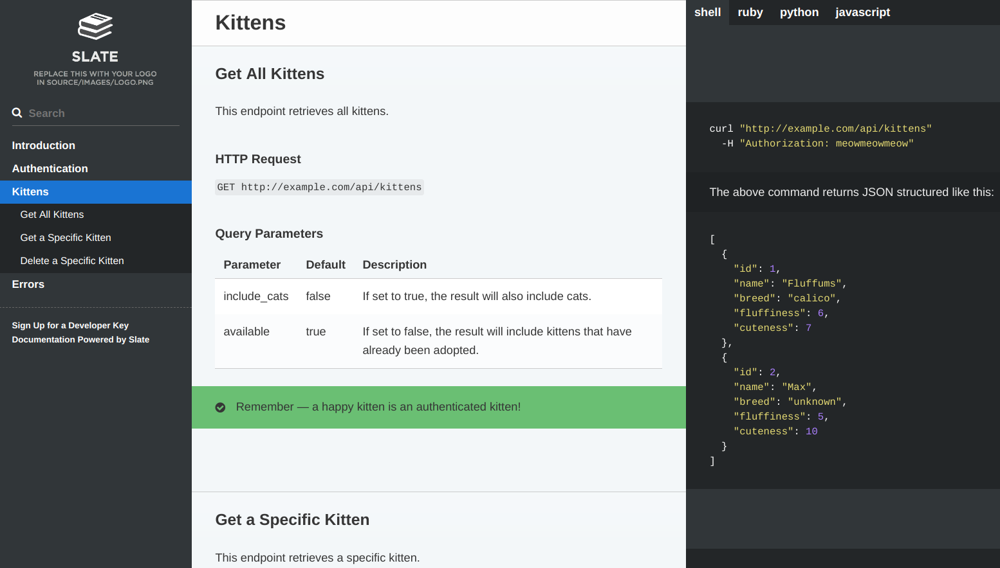

# Welcome to API Docs

This repository is the first attempt to achieve

 - A **Swagger UI** to be able to explore APIs  (see [Swagger UI](https://swagger.io/tools/swagger-ui/))
 - A **Slate** app to be able to document APIs  (see [Slate](https://github.com/lord/slate))

The repository contains a `Dockerfile` that basically manages how the `Swagger UI` and `Slate` apps should be run.

In order to run `Slate` we take the already generated `swagger.json` file and convert it into `markdown` compatible with `slate` and then feed it to the running `slate` app to serve it.

## Pre-requisites

 Ensure that you have the following

- Latest Node (v8.x) and NPM (v5.x)
- Docker
- Enabled the Swagger flag in `mt-parent/mt-service/yml/server-mysql.yml`
- Have `swagger.json` handy

Note: A `swagger.json` can be downloaded by visiting `http://localhost:8080/api/swagger/v2` of a mt-server instance that has the swagger-generation flag on.

 ## Get Started
 In order to start the `Swagger UI` and `Slate`  execute the first 3 commands from the `Setup` section

 1. Clone the repo

 2. Build the docker image

 3. Run the docker image with appropriate port binding

 4. Modify the annotations in java code and  `allowList.json` to add endpoints to be displayed

    (refer to `Action` section at the end for steps)

 5. Download `Swagger.json` file from `http://localhost:8080/api/swagger/v2` and feed it to `http://localhost:8081/home` 

    > to access ``http://localhost:8080/api/swagger/v2`` and download the file, you need

    - mt-server running

    - Enabled the Swagger flag in `mt-parent/mt-service/yml/server-mysql.yml`

      (ctrl-F for `swagger` , and set `enableSwaggerEndpoints` to true)

(refer to the `Setup` Section below for more detailed walk-through)

 ## Navigation

 Use the following links to navigate around (update the default server URL and port)

 - Swagger UI - http://localhost:8081/  (Show Swagger UI)
 - Upload a Swagger JSON file - http://localhost:8081/home
 - View Swagger JSON - http://localhost:8081/swagger (View Swagger JSON Source)
 -  Slate it - http://localhost:8081/slateit (Convert `swagger.json` to markdown and update slate)
 - API Documentation (Slate) - http://localhost:8082 (View API Documentation in Slate)

First, making sure to upload a valid `swagger.json` file (see section below how to obtain `swagger.json`). In order to make sure that `swagger.json` is valid, navigate to `Swagger UI link` and the API documentation should load.
In order to see the API documentation in `Slate` you need to click on `slateit` link and then navigate to `slate` documentation.

Note: Swagger UI runs in one port (8081) and Slate runs in another (8082)

 ## How does it work?
 - Swagger UI renders a `swagger.json` and a version of Swagger UI is run inside docker
 - Custom endpoints to point Swagger UI to newly uploaded `swagger.json`
 - The `slateit` endpoint reads the current `swagger.json` and converts it to `slate` compatible markdown and then updates the `/source/includes/main.md` file that is rendered in slate UI.
 - See details of what each file does at the end of this file

 ## Setup
 ### Ubuntu
 In order to setup the Swagger UI for use ensure that you have `Docker` , latest `Node` and `NPM` installed and working.

Clone the repository (change the URL if forked)

Navigate inside **apidocs** and run the `docker build` command

    sudo docker build -t apidocs .
After successful build start a docker container

```
sudo docker run --name apidocs -p 8086:8080 -p 8082:4567 apidocs
```

(it's likely you will need to rm existing docker container with steps in the following section)

## Troubleshooting
While running the container should you come across `The container name "/apidocs" is already in use by container` error message, then delete the container using the following command and given container hash and retry

    sudo docker rm {container_hash}
> Port being used

if you come across issues to do with `port being in use`, which depends on which port it is find out what is using the port using the following command

    lsof -i :8081
you can either:

- Pick the port id from the output of the above command and then run the following command to kill the process that is using it

    sudo kill -9 {outputedProcessId}
After the process is killed try running the docker again and it should work as expected.

or:

- simply run on another port

```
sudo docker build -t apidocs .
sudo docker run --name apidocs -p 8086:8080 -p 8082:4567 apidocs
```

> Get the followig error messages while building docker container

```
npm ERR! code EAI_AGAIN
npm ERR! errno EAI_AGAIN
npm ERR! request to https://registry.npmjs.org/jgexml failed, reason: getaddrinfo EAI_AGAIN registry.npmjs.org registry.npmjs.org:443
```

here are several things you can try:

- restart your computer

- restart services (docker engine and docker service)

  ```
  sudo service docker restart
  ```

- if it is still not working, checkout the following

  - `https://github.com/npm/npm/issues/16661`

  - `https://development.robinwinslow.uk/2016/06/23/fix-docker-networking-dns/`

> unable to access github when creating docker container

if you get error messages like

```
fatal: unable to access 'https://github.com/sdelements/node-slate.git/': Could not resolve host: github.com
```

try running

```
sudo service docker restart
```

 ## Libraries used

 The following nodejs modules are used
 - express (nodejs framework)
 - multer (file upload)
 - pug (view template)
 - [widdershins](https://github.com/Mermade/widdershins) (swagger/openapi to markdown convertor)

Other tools/libraries

 - Docker
 - [PM2*](http://pm2.keymetrics.io/)
 - node-slate**
 - Swagger UI (recent release, see docker file)

*PM2 is a process management library very useful for running and managing node processes. In this context, the `pm2-runtime` command is used to start a `expressjs` app that hosts `Swagger UI` as well as to run the `node-slate` (see [node-slate](https://github.com/sdelements/node-slate)).

**node-slate is a `nodejs` wrapper for `slate` . We clone the repo, and update the `main.md` and `logo.png` to show specific content.

 ## Known Issues

 - Both `Swagger UI` and `node-slate` are pulled from public repos
 - Clicking the `/slateit` will replace the `source/includes/main.md` with markdown generated off `swagger.json`
 - Not sure how the future changes from Swagger (i.e. new endpoints, updates, etc.) will get synced with work that's done with documentation (i.e. markdown sources for slate)
 - Not built for production
 - The `Dockerfile` could use some refactoring and best practices
 - The existing workflow of `/slateit` pushing changes to `slate` is non-final
 - The Slate Styling file might change overtime, right now in `StyleDiscard.md` we are just replace a certain string with our desired styling, which is not robust enough


 ## Contribution Guidelines

 - Please do not version `node_modules` or any IDE-specific files (make use of .gitignore)


## Page Structure



#### Introduction

#### Authentication

#### Resources

- this section contains all the endpoints, with all the methods in the sub-level

- this section is related to `allowList.json` shown below:

  ```
  { "/api/manager/etlJobs" :			---> the endpoint to display
    {"methods":						---> an array of methods to display
      ["get"],						---> just display the `Get` method
      "name":"Jobs"					---> name the endpoint to Jobs
    }
  }
  ```

#### Schemas

- All the entities related to the endpoints in allowList

- notice in the image above, there are clickable cells in the `response schema` section

  those cell are related endpoints of this entities and are automatically added to the page when its related endpoint is in allowList

  


## Code Structure

this section explainshow each file functions

### Utils Folder

- contains some `md` file of the text we want to add/remove from system styling files / the md file we generated
- contains `utils.js` with some helper functions

### Test Folder

- `test.js` : the actual test file

- `allowListAll`: the allowList containing all the endpoints(thus all the entities)  until the date this README.md is written. For testing purpose, all the display name of each endpoint is simply set to its path

- `allowListTest` is used to generate a light `md file` for testing function `modifyMdFile` in `modifyStrying.js`

- `v2.json` contains all the endpoints and all the entities in json form, it is the same as the raw json data extracted from java code, but description field is already added to each entity for testing purpose.

  The description is set to `entityName + "DisplayName"`, so `Id` will be displayed as `IdDisplayName`


### Server.js

##### /slateit

> purpose

convert swagger.json file to slate-compatible markdown and rebuilding slate with new content

> steps

1. `modifySlate`: modify slate styling files to be able to add one more level of nesting on nav bar
2. `JSON.parse`: read the obj from the swagger file
3. `restrict_data`:  go through the `json` file and filter it to only contain endpoints in the `allowList` and entities related to that endpoint
4. `converter`: widdershins converter to convert `.json` to `.md`
5. `modifyMdFile`: change fonts in `.md` file to accommodate the changes made to slate styling
6. `fs` write to `main.md`  file

> Note the naming used in the files

in the `obj` (represents the `swagger.json` file) there are two major fields

- Paths

  an json object containing all paths (endpoints)

  we store all endpoints in `allowList` in `allowedEndpoints`

- Definitions

  a json object containing definitions (entities)

  we store all entities related to all endpoints in `allowList` in `allowedEntities`

### restrict_data.js

##### restrictData

1. create two new lists to add in the modified endpoints and entities in the allowList

2. loop through all endpoints (`obj.paths`)

   if the endpoint is in allowList, loop through its methods and match with the allowed methods in the allowList

3. for that endpoint, we get related entities in its parameters (`getParamsEntity`) and responses (`getResponsesEntity`)

4. compare the two entities (since they can be undefined as there is no entity in parameters/responses) and add to `allowedEntities`(with `addEntityToAllowedEntities`)

5. add the endpoint to `allowedEndpoints`

6. replace parts of the obj with the new lists

##### addEntityToAllowedEntities

1. change the entity name to its description (which is the description we set in its Java code)

2. add the entity to `allowedEntities` and delete the `description` section as we already changed the entity entry name in `allowedEntities`

   (eg. allowedEntities[Jobs] gives you the obj that belongs to obj.definitions[ETLJobDTO])

3. for this entity (parent entity), there are some entities in its `properties` field that we want to link to, so we go through all its properties and look for `$ref` field

4. if the `refEntity` is not in `allowedEntities` add it by recursively calling `addEntityToAllowedEntities`

5. return `allowedEntities`

##### getParamsEntity

> find related entity for an endpoint in its parameters
>

1. if there is a field named`body`, check if there is a `$ref` field in the body, which links to the related entity
2. return the name of the related entity

##### getResponseEntity

> find related entity for an endpoint in its responses
>

1. loop through the responses of the `endpoint`, and search for the ones with 200 status code
2. if there is a `$ref` field in the body, which links to the related entity. get the `entityName`
3. return the name of the related entity

### modify_styling.js

> all the imported files

- DISCARD_FILE

  text at the top of the md file that is generated by slate

- STYLE_FILE

  part of the styling to be added into the `scss` file

- STYLE_DISCARD

  a certain part of the `scss` file that controls the slate styling that needs to be replaced

##### modifyMdFile

1. replace the text at the top of the file that we want to discard

2. replace all h3 and ### with \**** (bold)

3. go through all the endpoints in the allowList, if they are the first method of the endpoint, then add before them a header that represents the endpoint

   eg. add before the `Get job` method, the `Job` subheader

4. return md file in String

##### modifySlate

1. in `_toc.js` file, add `h3` selector
2. in `scss` file, replace certain styling, to add in ones for the h3 subheader


### utils.js

all helper functions

##### getRef

> get the $ref field when given a schema obj

deal with the case when the different structure which $ref` field is in

it can either be one related entity in the following structure:

```json
 "schema": { "$ref": "#/definitions/BlueprintDTO" }
```


or be an array of a certain entity in the following structure

```json
"schema": {
    "type": "array",
    "items": { "$ref": "#/definitions/AssignableDTO" }
}
```


### allowList.json

> purpose

include info of the endpoints you want to display under `Resources`

> structure

- a json object, in the form of:

```
{ "/api/manager/etlJobs" :	---> the path of the endpoint
  {"methods":
    ["get"],				---> the array of methods to display
    "name":"jobs"			---> the proper naming of this endpoint
  }
}
```

then the hierarchy displayed will be:

```json
Resources
	Jobs
		Get Jobs
```

- There will also be cases when for different endpoints, we want them to all be displayed under one subtitle

  for example, for the following two endpoints

  ```
  /api/manager/blueprints/{blueprintId}
  /api/manager/blueprints/{blueprintId}/edges
  ```

  **if we want them to be all under the subtitle `Blueprint`, then we need to list them in the allowList consecutively**, because we modify the md file assuming methods under one subtitile are listed consecutively.

### Introduction.md

> purpose

introduction and authentication text that is added to `main.md`

### Index.yml

> file purpose

the slate settings file exists in docker container

> changes made

modify the language tab to only inlcude shell, http, javascript

## Actions

this section gives instruction for you to add/modify the api docs

#### Add endpoints to be displayed in docs

- Add endpoints to `allowList`, and specify in the methods array what methods you want to display

  refer to `Resources`  section under `Page Structure`  for visual examples

  refer to the `allowList.json` structure in the section above for its structure and how to add

- you may want to also modify the naming of endpoints and entities you display >>>


#### Add better naming for endpoints and entities

1. Change the naming of the **entities** related to this endpoint in `java` code, by using `@ApiModel` with the `value` field

   eg.

   ```java
   @ApiModel(value="Step")
   public class ETLStepDTO {...}
   ```

   then ETLStepDTO will be renamed to Step

   

2. Change the name of the **endpoints** using `@ApiOperation` with field `nickname`

   Change the tags the endpoint belongs to (eg. `Resources`) using field `tags`

   eg.

   ```java
   @GET
   @ApiOperation(value = "Retrieve a list of all manager-level jobs.", response = ETLJobDTO.class, responseContainer = "list", tags="Resources", nickname = "Get Jobs")
   @CheckPermissions(value = "read:etlJob")
   public List<ETLJobDTO> getETLJobs() {...}
   ```


#### Add description to endpoints and objects

1. Add descripitons to the **entities** related to this endpoint in `java` code, by using `@ApiModel` with the `description` field

eg.

```java
@ApiModel(description="This is the description for Job")
public class ETLJobDTO {...}
```

then ETLJobDTO will have a brief description


2. Change the name of the **endpoints** using `@ApiOperation` with field `value`

   eg.

   ```java
   @GET
   @ApiOperation(value = "Retrieve a list of all manager-level jobs.", response = ETLJobDTO.class, responseContainer = "list", tags="Resources", nickname = "Get Jobs")
   @CheckPermissions(value = "read:etlJob")
   public List<ETLJobDTO> getETLJobs() {...}
   ```


#### Add sample data for entities in right side-bar

use `@ApiModelProperty`

https://github.com/swagger-api/swagger-core/wiki/annotations#apimodelproperty

eg.

```java
public class ETLJobDTO extends BaseEntityDTO {
	@ApiModelProperty(example="Test")
	private String name;
	...
}
```

then on the final example generated by slate the `name` field shows "Test" instead of "string"


#### Change Tag/Header endpoints belong to

Change the tags the endpoint belongs to (eg. `Resources`) using field `tags`

eg.

```
@GET
@ApiOperation(value = "Retrieve a list of all manager-level jobs.", response = ETLJobDTO.class, responseContainer = "list", tags="Resources", nickname = "Get Jobs")
@CheckPermissions(value = "read:etlJob")
public List<ETLJobDTO> getETLJobs() {...}
```


Now at this point you have successfully added the endpoints, test it by running `apidocs` server with instructions in the `Quick Getting Started` section !

-------

Here are instructions of some optional steps to improve the API Docs >>>


#### Add content to introduction and authentication section

- Modify exisiting text in `utils/Introduction.md` file


#### Show more requests in right sidebar

- Modify the `utils/index.yml` file, which is a slate system file to decide `language_tabs`
- Modify `options.language_tabs` object in `utils.js`, which tells `widdershins` what language tabs to convert to


#### Add deeper nesting in the left navbar

- refer to `modify_styling.js` and its `modifySlate` function
- change two system files in slate to add more selectors in `_toc.js` and styling for that selector in `screen.css.scss` file
- useful link:  https://github.com/lord/slate/wiki/Deeper-Nesting


#### Add descriptions for Tags

- in the json file `widdershins` generated, there is a field called `tags`, which is an array of objects, and controls all the tags shown

example of how to use:

```json
"tags": [
    {
      "name": "pet",
      "description": "Everything about your Pets",
      "externalDocs": {
        "description": "Find out more",
        "url": "http://swagger.io"
      }
    },
    {
      "name": "store",
      "description": "Access to Petstore orders"
    },
    {
      "name": "user",
      "description": "Operations about user",
      "externalDocs": {
        "description": "Find out more about our store",
        "url": "http://swagger.io"
      }
    }
  ],
```


## Useful Resources

> example of how to use widdershins converter

https://github.com/tobilg/api2html/blob/master/bin/api2html.js

> example of how the styling files in slate works

https://www.sitepoint.com/writing-api-documentation-slate/

> useful options in widdershins

https://github.com/Mermade/widdershins


## Future Development

**Use `Hidden` field instead of `allowList`**

when the endpoints in the allowList grows, we might want to add `hidden = "true"` field to annotations of endpoints, so to avoid manually maintaining allowList
